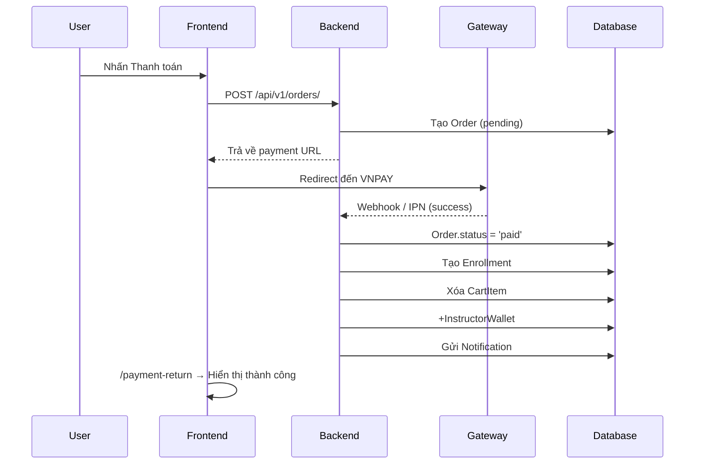

# SYSTEM_FLOWS.md — EduVNU / EduHub
# Tài liệu Kiến trúc & Luồng Nghiệp Vụ
> Cập nhật: 01/05/2026

---

## 1. Tổng Quan Kiến Trúc (Architecture Overview)

```
┌──────────────────────────────────────────────────────────────┐
│                        CLIENT LAYER                          │
│  React (Vite) + Vanilla CSS                                  │
│  /frontend/src/                                              │
│   ├── App.jsx            ← Router + Layout shell             │
│   ├── context/           ← Global state (Auth, Cart, Notif)  │
│   ├── components/        ← Shared UI (Header, Footer, ...)   │
│   ├── pages/             ← Page-level components             │
│   ├── api/axios.js       ← HTTP client (JWT auto-refresh)    │
│   └── utils/             ← Helpers                          │
└───────────────────────────────┬──────────────────────────────┘
                                │ REST API (JSON / JWT Bearer)
                                │ Base URL: /api/v1/
┌───────────────────────────────▼──────────────────────────────┐
│                       SERVER LAYER                           │
│  Django REST Framework (DRF)                                 │
│  /backend/                                                   │
│   ├── apps/accounts/     ← Auth, User Profile               │
│   ├── apps/courses/      ← Courses, Lessons, Progress       │
│   ├── apps/cart/         ← Shopping Cart                    │
│   └── apps/orders/       ← Orders, Payment, Webhook         │
└───────┬───────────────────────────────────────┬──────────────┘
        │                                       │
┌───────▼──────────┐                 ┌──────────▼─────────────┐
│  MS SQL Server   │                 │  Redis / RAM Buffer     │
│  (Primary DB)    │                 │  (Heartbeat Buffer)     │
└──────────────────┘                 └────────────────────────┘
```

### Tech Stack
| Layer | Technology |
|-------|-----------|
| Frontend | React 18 + Vite, Vanilla CSS, Axios |
| Backend | Django 4.x + Django REST Framework |
| Database | MS SQL Server (production) |
| Cache/Buffer | Redis / In-memory (heartbeat) |
| Background | Celery + Celery Beat |
| Payment | VNPAY (webhook IPN), Stripe (optional) |
| Auth | JWT (SimpleJWT) + Google OAuth |

---

## 2. Cấu Trúc Thư Mục

```
lolo/
├── frontend/
│   ├── src/
│   │   ├── App.jsx                 ← App root + Routing (4 nhóm route)
│   │   ├── App.css                 ← Global styles (design system)
│   │   ├── index.css               ← CSS reset + variables
│   │   ├── main.jsx                ← React DOM entry
│   │   ├── api/
│   │   │   └── axios.js            ← Centralized HTTP client
│   │   ├── components/
│   │   │   ├── Header.jsx          ← Global nav header
│   │   │   ├── Footer.jsx          ← Global footer
│   │   │   ├── MegaMenu.jsx        ← Mega dropdown navigation
│   │   │   ├── ProtectedRoute.jsx  ← Auth + Role guard HOC
│   │   │   ├── InstructorSidebar.jsx
│   │   │   ├── LoadingUI.jsx       ← Loading, Skeleton components
│   │   │   └── ScrollToTop.jsx
│   │   ├── context/
│   │   │   ├── AppProviders.jsx    ← Gom tất cả providers
│   │   │   ├── AuthContext.jsx     ← User auth state
│   │   │   ├── CartContext.jsx     ← Cart item count
│   │   │   └── NotificationContext.jsx ← Notifications + unread count
│   │   ├── pages/                  ← 38 page components
│   │   ├── hooks/
│   │   │   └── usePageSEO.js
│   │   └── utils/
│   │       ├── courseImages.js
│   │       └── fixEncoding.js
│   └── .env.example                ← Environment variables template
│
├── backend/
│   ├── apps/
│   │   ├── accounts/               ← User, Auth, Profile
│   │   ├── courses/                ← Course, Lesson, Progress, Review...
│   │   ├── cart/                   ← Cart, CartItem
│   │   └── orders/                 ← Order, OrderItem, Payment, Webhook
│   ├── core/                       ← Django settings, URLs, WSGI
│   └── scripts/                    ← Seed scripts, migration helpers
│
├── docker-compose.yml
├── AGENTS.md                       ← AI coding rules (luôn đọc trước)
└── SYSTEM_FLOWS.md                 ← Tài liệu này
```

---

## 3. Routing Architecture (Frontend)

Routes trong `App.jsx` được chia thành 4 nhóm rõ ràng:

### 3.1 Public Routes (không cần đăng nhập)
| Path | Page | Mô tả |
|------|------|-------|
| `/` | Home | Trang chủ, danh sách khóa học |
| `/login` | Auth | Đăng nhập / Đăng ký / Google OAuth |
| `/forgot-password` | ForgotPassword | Gửi email reset password |
| `/reset-password/:uidb64/:token` | ResetPassword | Đổi mật khẩu mới |
| `/course/:courseId` | CourseDetail | Chi tiết khóa học |
| `/degrees` | Degrees | Danh sách chương trình bằng cấp |
| `/contact`, `/faq`, `/policies`, `/about`, `/career`, `/plus` | Static pages | |

### 3.2 Protected Routes (cần đăng nhập)
Bọc bằng `<ProtectedRoute>` → tự động redirect `/login` nếu chưa đăng nhập.

| Path | Page | Mô tả |
|------|------|-------|
| `/profile` | Profile | Hồ sơ người dùng |
| `/cart` | Cart | Giỏ hàng |
| `/checkout` | Checkout | Thanh toán |
| `/payment-return` | PaymentReturn | Kết quả thanh toán |
| `/orders` | Orders | Lịch sử giao dịch |
| `/learn/:courseId` | Learn | Trang học video |
| `/schedule` | Schedule | Lịch học / danh sách đã đăng ký |
| `/documents` | Documents | Giáo trình |
| `/accomplishments` | Accomplishments | Thành tích, chứng chỉ |
| `/wishlist` | Wishlist | Yêu thích |
| `/certificate/:courseId` | CertificateView | Xem chứng chỉ |

### 3.3 Instructor Routes (cần `is_instructor` hoặc `is_staff`)
Bọc bằng `<ProtectedRoute role="instructor">`.

| Path | Page |
|------|------|
| `/instructor` | InstructorDashboard |
| `/instructor/courses` | InstructorCourseList |
| `/instructor/create-course` | InstructorCreateCourse |
| `/instructor/course/:id/curriculum` | InstructorCourseCurriculum |
| `/instructor/students` | InstructorStudents |
| `/instructor/reviews` | InstructorReviews |
| `/instructor/finance` | InstructorFinance |
| `/instructor/analytics` | InstructorAnalytics |
| `/instructor/settings` | InstructorSettings |
| `/instructor/help` | InstructorHelp |

### 3.4 Admin Routes (chỉ `is_staff`)
Bọc bằng `<ProtectedRoute role="admin">`.

| Path | Page |
|------|------|
| `/admin` | AdminDashboard |

---

## 4. Context Architecture (State Management)

```
AppProviders
 └── AuthProvider          ← user, login, logout, register, refreshUser
      └── CartProvider     ← cartCount, refreshCart()
           └── NotificationProvider  ← notifications, unreadCount, markRead()
```

### Quy tắc sử dụng Context
- `useAuth()` → Lấy thông tin user, kiểm tra login
- `useCart()` → Lấy số item giỏ hàng; gọi `refreshCart()` sau khi add/remove
- `useNotifications()` → Lấy danh sách thông báo; gọi `markRead(id)` khi đọc

---

## 5. Luồng Nghiệp Vụ Chính (Core Business Flows)

### A. Luồng Xác Thực (Authentication)
```
User nhập credentials
    → POST /api/v1/accounts/login/
    → Backend trả { access, refresh, user }
    → Frontend lưu vào localStorage
    → AuthContext.setUser(user)
    → Redirect về trang trước (from state) hoặc /
```
- **Token refresh**: Khi access token hết hạn (401), axios interceptor tự động gọi `/accounts/token/refresh/` và retry request gốc.
- **Force logout**: Nếu refresh token cũng hết hạn → xoá localStorage + redirect `/login`.

### B. Luồng Đăng Ký & Thanh Toán (Enrollment & Payment)
```
1. User thêm vào Cart    → POST /api/v1/cart/items/
2. Xem giỏ hàng          → GET  /api/v1/cart/my_cart/
3. Checkout              → POST /api/v1/orders/
   Backend tạo Order {status: 'pending'}
   ⚠️ KHÔNG xóa Cart ở bước này
4. Redirect → VNPAY/Stripe
5. VNPAY gọi webhook     → POST /api/v1/orders/webhook/
6. Backend xử lý:
   - Order.status = 'paid'
   - Xóa CartItem
   - Tạo Enrollment (cấp quyền học)
   - Cộng InstructorWallet
   - Gửi Notification (user + instructor)
7. Frontend /payment-return → hiển thị thành công
```

### C. Luồng Học Tập & Tiến Độ (Learning & Heartbeat)
```
1. User vào /learn/:courseId
2. Xem video (YouTube iframe)
3. Mỗi 30-60s: POST /api/v1/progress/heartbeat/ { lesson_id, seconds }
4. Backend ghi vào RAM Buffer (không ghi thẳng SQL)
5. Celery Worker (mỗi 5 phút): flush Buffer → UserProgress DB
6. Khi hoàn thành 100% bài học → Certificate available
```

### D. Luồng Giảng Viên (Instructor Lifecycle)
```
1. Tạo khóa học: POST /api/v1/instructor-courses/
2. Thêm Chapter + Lesson
3. Submit review: PATCH → status = 'pending'
4. Admin duyệt qua /admin → status = 'published'
5. Notification gửi cho Instructor
6. Học viên đăng ký → InstructorWallet +revenue
7. Instructor xem Analytics (SQL Aggregates)
8. Rút tiền: POST /api/v1/instructor-courses/withdraw/
```

### E. Luồng Thông Báo (Notification Flow)
```
Event xảy ra (order paid / course approved / rejected)
    → Backend tạo Notification record
    → Frontend NotificationContext fetch /courses/notifications/
    → Header Bell hiển thị unread count (badge đỏ)
    → User click → markRead(id) + navigate(notif.link)
```

---

## 6. API Endpoints Tham Chiếu

### Accounts (`/api/v1/accounts/`)
| Method | Path | Mô tả |
|--------|------|-------|
| POST | `/login/` | Đăng nhập |
| POST | `/register/` | Đăng ký |
| POST | `/google-login/` | Google OAuth |
| POST | `/token/refresh/` | Refresh JWT |
| GET/PATCH | `/users/me/` | Xem/Cập nhật profile |

### Courses (`/api/v1/courses/`)
| Method | Path | Mô tả |
|--------|------|-------|
| GET | `/courses/` | Danh sách khóa học (filter: category, level, q, price_max) |
| GET | `/courses/:id/` | Chi tiết khóa học |
| GET | `/courses/my_courses/` | Khóa học đã đăng ký |
| GET | `/categories/` | Danh mục |
| GET | `/degree-programs/` | Chương trình bằng cấp |
| GET | `/notifications/` | Thông báo của user |
| POST | `/notifications/:id/mark_as_read/` | Đánh dấu đã đọc |

### Orders (`/api/v1/orders/`)
| Method | Path | Mô tả |
|--------|------|-------|
| POST | `/` | Tạo order mới |
| GET | `/` | Lịch sử đơn hàng |
| POST | `/webhook/` | VNPAY IPN callback |

---

## 7. Sơ Đồ Sequence — Luồng Thanh Toán



---

## 8. Core Entities (ERD Summary)

| Entity | Quan trọng nhất |
|--------|----------------|
| `User` | is_student, is_instructor, is_staff |
| `Course` | status: draft/pending/published/rejected |
| `Enrollment` | user ↔ course (hoặc degree_program) |
| `UserProgress` | user ↔ lesson, time_spent (seconds) |
| `Order` / `OrderItem` | status: pending/paid/failed |
| `InstructorWallet` | balance, bank info |
| `WalletTransaction` | Ledger: earning/withdrawal/refund |
| `Notification` | user, title, message, is_read, link |
| `Certificate` | enrollment, uuid, issued_at |
| `DegreeProgram` | curriculum (JSON), videos (JSON) |

---

## 9. Quy Tắc Phát Triển

### Frontend
- Mọi route cần login → bọc bằng `<ProtectedRoute>`
- Mọi API call → dùng `api` từ `../api/axios`, KHÔNG dùng `fetch`
- Sau khi add/remove giỏ hàng → gọi `refreshCart()`
- Sau khi cập nhật profile → gọi `refreshUser()`
- Tất cả form phải có `try/catch` + hiển thị lỗi cho user

### Backend
- Filter phức tạp → dùng `Exists()` subquery, KHÔNG dùng `.distinct()` + JOIN (MSSQL)
- Lấy danh sách kèm số liệu → dùng `aggregate()` tại SQL
- Luôn `select_related` và `prefetch_related` để tránh N+1
- Mọi action quan trọng → tạo `Notification` record

---

## 10. Các Gotcha Quan Trọng

| Vấn đề | Giải pháp |
|--------|----------|
| MSSQL + `.distinct()` + JOIN crash | Dùng `Exists()` subquery |
| Video YouTube bị chặn embed | Dùng ID đã whitelist trong `fix_all_videos_final.py` |
| Cart bị xóa sớm | Chỉ xóa khi `Order.status == 'paid'` (webhook) |
| Spline 3D watermark | `overflow: hidden` cha + `height: calc(100% + 80px)` iframe |
| Logo quá nhiều whitespace | `transform: scale(...)` thay vì resize ảnh |
| `user.username` undefined | Luôn dùng `(user?.username \|\| 'U')[0]` |
